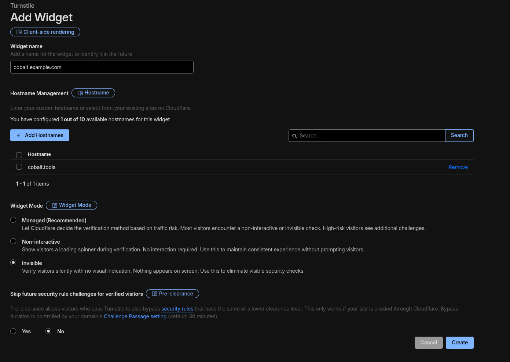
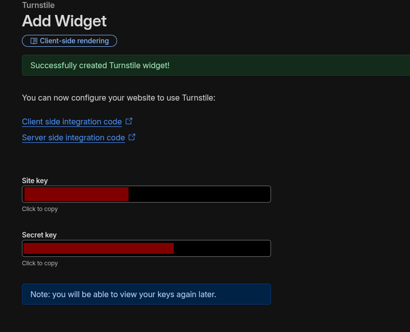
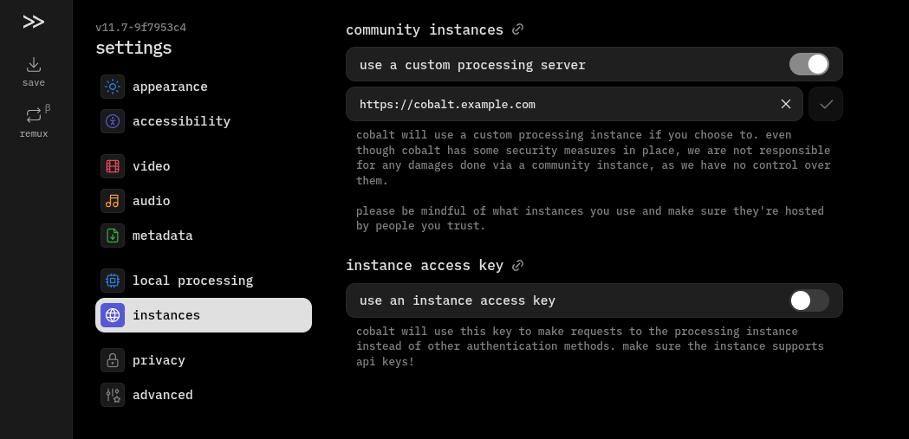

!!! danger "Warning"
    This guide uses a fork of cobalt. It is not using the official cobalt codebase. This fork is constantly updated in order to fix things that come up. You can see the source code [here](https://github.com/zImPatrick/cobalt).

    This guide is not official Use at your own risk.

This guide showcases how to setup your own cobalt API instance on a server. Installing on a server requires a bit more setup, as some services do not like requests from servers. We'll be setting up a reliable proxy, cobalt, and valkey.

Thank you to [this guide](https://gist.github.com/ndzn/47afb39e42956435aaa603dd29690b76) by [ndzn](https://github.com/ndzn) for showing how to add the Clouldflare WARP stuff.

## Requirements
* You need Docker, since cobalt uses it. You can install it [here](https://docs.docker.com/engine/install/).
* A server with IPv6 support.
    * Try to run `curl -I -6 https://example.com` to check if your server can connect to IPv6 addresses.
* Webserver, something like Caddy or NGINX.
* A domain or subdomain for cobalt, pointed at your server.
* Cloudflare Account

## Setup Docker Network
We need to first make a Docker network that allows for IPv6 support. Run this command below to make a new `cobalt` network. This will create a Docker network named `cobalt` with IPv6 support.

```sh
docker network create --driver bridge --ipv6 --subnet fd00:c0ba:105::/64 cobalt
```

## Setup Turnstile
In order to protect your instance, it's recommended to setup Turnstile. This forces all requests to be validated that they are human, preventing bots from using your instance.

Head to the [Cloudflare Dashboard](https://dash.cloudflare.com) and head to Application Security > Turnstile. Click Add widget. Fill in the details like so:



Afterwards, make the widget.



Save both the site and secret keys.

## Setup wgcf
Head over to [https://github.com/ViRb3/wgcf/releases/latest](https://github.com/ViRb3/wgcf/releases/latest). Copy the link that matches your server architecture under Assets. For most servers, it's `linux_amd64`.

Download it like so. Replace the link with the one you copied.
```bash
wget https://github.com/ViRb3/wgcf/releases/download/vx.x.x/wgcf_x.x.x_linux_amd64
```

After, run the commands below. Again, replace the filename with the one you downloaded.
```sh
chmod +x ./wgcf_x.x.x_linux_amd64
./wgcf_x.x.x_linux_amd64 register
./wgcf_x.x.x_linux_amd64 generate
```

This will generate two files in the same directory: `wgcf-account.toml` and `wgcf-profile.conf`. Keep these files. This creates a profile to connect to Cloudflare Warp.

## Setup Containers
Make a `compose.yml` file somewhere on your server, preferably in it's own folder. Copy and paste the following:
```yaml
services:
  cobalt_api:
    image: ghcr.io/zimpatrick/cobalt:staging
    restart: unless-stopped
    container_name: cobalt_api
    environment:
      - API_URL=https://api.url.example/
      - TURNSTILE_SITEKEY=
      - TURNSTILE_SECRET=
      - JWT_SECRET=
      - CUSTOM_INNERTUBE_CLIENT=TV_SIMPLY
      - YOUTUBE_GENERATE_PO_TOKENS=1
      - YOUTUBE_USE_ONESIE=1
      - HTTP_PROXY=http://warp_proxy:9001
      - API_REDIS_URL=redis://valkey:6379
      - API_INSTANCE_COUNT=4
    tmpfs:
      - /tmp
    healthcheck:
      test: wget -nv --tries=1 --spider http://127.0.0.1:9000 || exit 1
      interval: 30s
      timeout: 5s
      retries: 2
    ports:
      - 127.0.0.1:9000:9000
    networks:
      - cobalt
  warp_proxy:
    image: qmcgaw/gluetun
    container_name: warp_proxy
    restart: unless-stopped
    environment:
      - VPN_SERVICE_PROVIDER=custom
      - VPN_TYPE=wireguard
      - WIREGUARD_ENDPOINT_IP=162.159.192.1
      - WIREGUARD_ENDPOINT_PORT=2408
      - WIREGUARD_PUBLIC_KEY=
      - WIREGUARD_PRIVATE_KEY=
      - WIREGUARD_ALLOWED_IPS=0.0.0.0/0,::/0
      - WIREGUARD_ADDRESSES=172.16.0.2/32,2606:4700:110:80f7:d0bc:5a6f:226a:5169/128
      - HTTPPROXY=on
      - HTTPPROXY_LISTENING_ADDRESS=:9001
      - HTTPPROXY_STEALTH=on
    cap_add:
      - NET_ADMIN
    devices:
      - /dev/net/tun:/dev/net/tun
    sysctls:
      - net.ipv6.conf.all.disable_ipv6=0
    networks:
      - cobalt
  valkey:
    image: valkey/valkey
    container_name: valkey
    expose:
      - "6379"
    networks:
      - cobalt
networks:
  cobalt:
    external: true
```

Breakdown of the containers:

* `cobalt_api` - cobalt, of course.
* `warp_proxy` - the proxy we are using for all requests make by cobalt.
* `valkey` - cache for cobalt, which makes it perform better.

You'll need to edit some of the environment variables. Here are the ones to change:

* `cobalt_api`
    * `API_URL` - set this to the public domain you are going to use to access cobalt.
    * `TURNSTILE_SITEKEY` - set this to your site key from Turnstile earlier.
    * `TURNSTILE_SECRET` - set this to your secret key from Turnstile earlier.
    * `JWT_SECRET` - run `cat /dev/urandom | tr -dc 'A-Za-z0-9' | head -c 64; echo` and set this to what the command outputs. This generates a random string of 64 characters.
* `warp_proxy`
    * `WIREGUARD_PUBLIC_KEY` - set this to the `PublicKey` value from `wgcf-profile.conf`.
    * `WIREGUARD_PRIVATE_KEY` - set this to the `PrivateKey` value from `wgcf-profile.conf`.
    * `WIREGUARD_ENDPOINT_IP` - this should be the A record of `engage.cloudflareclient.com`. This probably won't change, but double check it [here](https://www.whatsmydns.net/#A/engage.cloudflareclient.com).

After setting the containers up, run the command below to start them.
```sh
docker compose up -d
```

When you want to edit the compose file, simply run:
```sh
docker compose down # stop containers
docker compose up -d # start them up
```

!!! info "Information"
    Make sure you run the `docker compose` commands where your `compose.yml` is.

## Setup Reverse Proxy
You'll need to setup a reverse proxy to proxy your domain to point to cobalt. This can be done with different webservers, but you want to point it to `http://localhost:9000`.

These are examples, so seek out what webserver software you are using.

```caddy title="Caddy"
cobalt.example.com {
    reverse_proxy localhost:9000
}
```

```caddy title="NGINX"
# HTTP, redirected to HTTP
server {
    listen 80;
    server_name cobalt.example.com;

    return 301 https://$host$request_uri;
}

# HTTPS
server {
    listen 443 ssl;
    server_name cobalt.example.com;

    ssl_certificate /etc/letsencrypt/live/cobalt.example.com/fullchain.pem;
    ssl_certificate_key /etc/letsencrypt/live/cobalt.example.com/privkey.pem;

    location / {
        proxy_pass http://127.0.0.1:9000;
    }
}
```

## Use the API
Head to [cobalt.tools](https://cobalt.tools) in your browser. Head to Settings > instances and enable `use a custom processing server`. In the textbox, add your public domain/subdomain you have cobalt setup on. Click the check mark next to it. **You will see a warning, please take the time to read and understand it!**



You are all set!