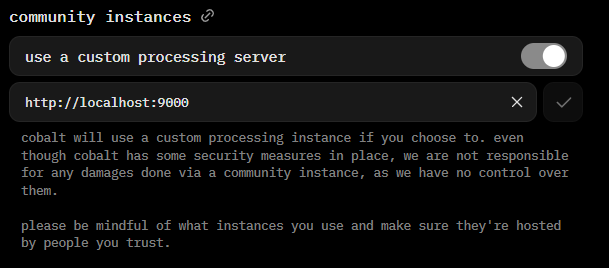

!!! danger "Warning"
    This guide uses a fork of cobalt. It is not using the official cobalt codebase. This fork is constantly updated in order to fix things that come up. You can see the source code [here](https://github.com/zImPatrick/cobalt).

    This guide is not official Use at your own risk.

This guide showcases how to setup your own cobalt API instance on a Windows machine. This instance runs locally on your own computer.

The benefit to running your own instance locally is cobalt will make all requests using your home internet. Most services (like YouTube) do not like requests from servers. Using your own home internet makes it seem more "trustable" allowing things to work way more often. There is also a lot less requests, so you are prone to not being blocked. They basically see you as a more real request rather than a bot one.

## Requirements
* [git](https://git-scm.com/downloads/win)
    * Choose `Git for Windows/x64 Setup`
* [Node.js](https://nodejs.org/en/download)
    * Use the options at the top to select Windows and follow the steps it provides.

!!! info "Information"
    When running commands, use Windows Terminal, not Command Prompt.

## Install pnpm
cobalt uses `pnpm`. Open up Windows Terminal and run:
```sh
npm install -g pnpm@latest-10
```

## Clone cobalt
We need to clone cobalt's codebase. Run the commands in order below:
```sh
cd "$env:USERPROFILE\Desktop"
git clone https://github.com/zImPatrick/cobalt.git
cd cobalt/api
notepad .env
```
These commands will clone cobalt's codebase to your desktop and open Notepad, editing a `.env` file. In the Notepad, copy and paste below:
```
API_URL=http://localhost:9000/
CUSTOM_INNERTUBE_CLIENT=TV_SIMPLY
YOUTUBE_GENERATE_PO_TOKENS=1
YOUTUBE_USE_ONESIE=1
```

Press ++ctrl+s++ to save, and close Notepad.

## Run cobalt
In the terminal Window from the previous step, run the commands below. If you closed it, reopen Terminal and run `cd "$env:USERPROFILE\Desktop"\cobalt`.
```bash
pnpm install
pnpm start
```
This will install cobalt's dependencies and start it. You should see something like so:
```ts

cobalt API ^ω^
~~~~~~
version: 11.7.1
commit: 310e7180fcd40c29f4fbdd04476ce36524efa34d
branch: meowing.de
remote: zImPatrick/cobalt
start time: Thu, 16 Apr 2026 19:49:33 GMT
~~~~~~
url: http://localhost:9000/
port: 9000
```

## Use it
Head to [cobalt.tools](https://cobalt.tools) in your browser. Head to Settings > instances and enable `use a custom processing server`. In the textbox, add `http://localhost:9000`. Click the check mark next to it. **You will see a warning, please take the time to read and understand it!**



You are all set!

cobalt will only work when the Terminal window is open. If you closed it and want to start it again, run the commands below:
```bash
cd "$env:USERPROFILE\Desktop\cobalt"
pnpm install
pnpm run
```

Make sure to re-enable "use a custom processing server" under Settings > instances on [cobalt.tools](https://cobalt.tools).