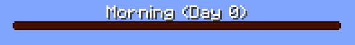
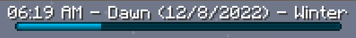

	
	
	
	
	

TimeBar lets you visualize the current world time as a bossbar. See the time of day whenever!

<figure markdown="span">
  
  Example usage of time tracking.
</figure>
<figure markdown="span">
  
  Support for [RealisticSeasons](https://www.spigotmc.org/resources/93275/)
</figure>

## Features
- Completely customized how the TimeBar looks.
  - Change the color.
  - Change the text that is shown on it.
- [PlaceHolderAPI](placeholders.md) support. 
- Configure multiple TimeBars and which worlds they display in.
- Disable TimeBar with a command if you don't want to see it.
- Option to only show when players hold a clock.
- Support for [RealisticSeasons](https://www.spigotmc.org/resources/93275/) (must use version 10.5.1 or higher).
- Support for [AdvancedSeasons](https://www.spigotmc.org/resources/114050/).