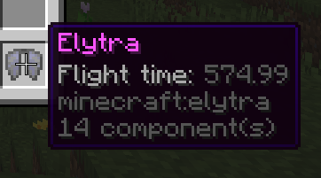

	
	
	
	
	

ToolStats is a Paper plugin that displays various stats about tools. This plugin is inspired off of [GearStats](https://www.spigotmc.org/resources/gearstats.12960/). You can either track all statistics by default, or a use a token system to add statistics to tool/armor. You can configure how each statistic is shown on the item, or disable it!

Here is everything it tracks:

- Blocks mined (pickaxes, shovels, axes, hoes, shears).
- Crops mined (hoes).
- Player/mob kills (swords, axes, tridents, bows/crossbows, mace).
- Ownership of items when crafted, looted (from chests), traded, spawned via creative, and caught from fishing.
- Armor damage taken.
- Damage done with weapons.
- Fish caught.
- Sheep sheared.
- Arrows shot (bows/crossbows).
- Flight time with elytras.

