The token system is a way for players to add stats to items they want. Players either craft or are given a token to add to an item. If this system is enabled, all tools/armor will only track statistics once a token is applied to it. There are different tokens for different statistics.

However, **origin of items will still be tracked.** You can disable this in the `enabled` section of the config.

!!! danger "Warning"
    You should decide if you want to use the token system or regular system only once. Swapping between modes can cause issues as it's not fully tested.

    The plugin will try it's best to swap, but unexpected issues can occur.

## Setup
To enable, set `tokens.enabled` to `true` in your config. Afterwards, **RESTART YOUR SERVER!**

## Obtaining Tokens
Players can either craft tokens or you can use commands to give them. By default, tokens can be crafted. If you want to disable this, set `craft-tokens` to `false` in your config. Below are the crafting recipes.

If you want to use commands, you can use `/toolstats givetokens <player> <token-type>`. You can specify more than one by using  `/toolstats givetokens <player> <token-type> <amount>`. Requires `toolstats.givetokens` permission.

| Blocks Mined | Player Kills | Mob Kills |
|---|---|---|
| 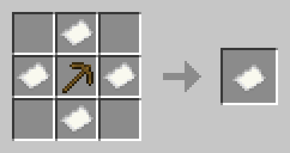  ID: `blocks-mined` | 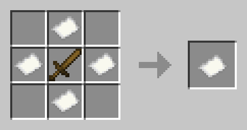  ID: `player-kills` | 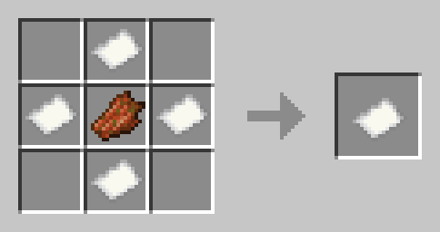  ID: `mob-kills` |

| Crops Mined | Sheep Sheared | Fish Caught |
|---|---|---|
| 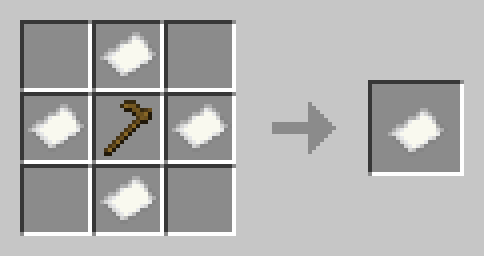 ID: `crops-mined` | 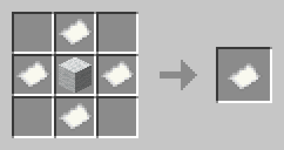  ID: `sheep-sheared` | 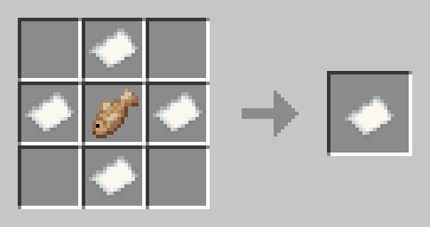  ID: `fish-caught` |

| Flight Time | Arrows Shot | Damage Taken |
|---|---|---|
| 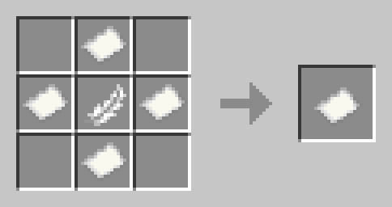  ID: `flight-time` | 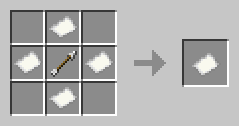  ID: `arrows-shot` | 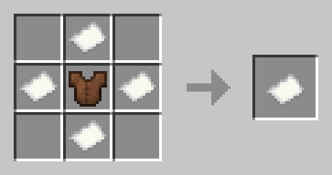  ID: `damage-taken` |

| Damage Done |
|---|
| 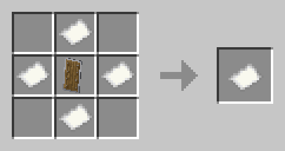  ID: `damage-done` |

## Using Tokens
To use a token, simply apply it in an anvil like below. You can configure how many levels it takes for each in the config.
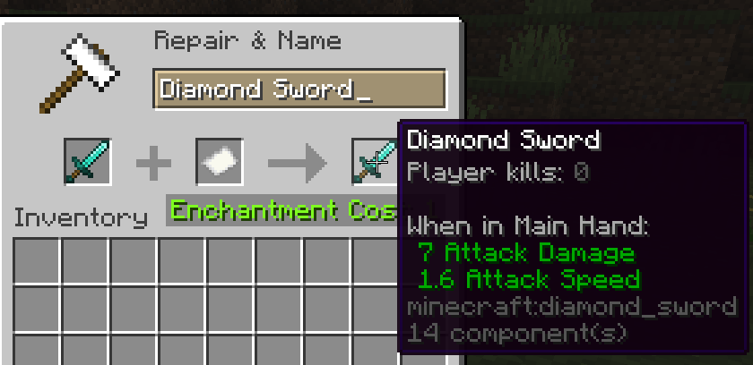

## Reset Token
There is a special reset token, which will **RESET** all tracked stats of an item. This does **NOT** remove the tokens on the item, but **sets the values to zero**. This also does **NOT** remove the origin of the item (crafted, traded, etc).

Apply it like any other token.

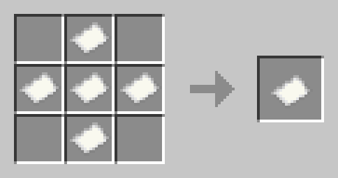  ID: `reset`

## Remove Token
There is a special remove token, which will **REMOVE** all tracked stats of an item. This does **NOT** remove the origin of the item (crafted, traded, etc).

Apply it like any other token.

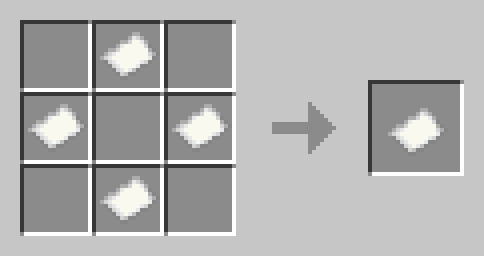  ID: `remove`