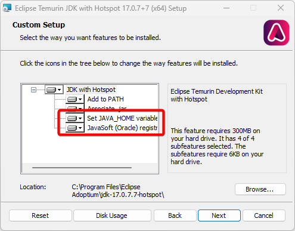

## Windows
You will need at least Java 17 or higher. To install Java, head [here](https://adoptium.net/releases.html?variant=openjdk17) and download the latest release labeled "Windows." Download the file labeled ".msi" and run it.

During the installation, make sure to enable `Set JAVA_HOME variable` and `JavaSoft (Oracle) registry keys`.

<figure markdown="span">
  
</figure>

Download the `exe` file from the [releases page](https://github.com/hyperdefined/CustomLauncherRewrite/releases). Create a new folder somewhere on your PC. It does not matter where.
After downloading, move the `exe` file to the new folder you created. From there, run the program! You are all set to go.

## Linux
You will need at least Java 17 or higher. You can see what Java version you are running by using thee command `java -version`.
```shell-session
hyper@hyperbox:~$ java -version
openjdk version "17.0.4" 2022-07-19
OpenJDK Runtime Environment Temurin-17.0.4+8 (build 17.0.4+8)
OpenJDK 64-Bit Server VM Temurin-17.0.4+8 (build 17.0.4+8, mixed mode, sharing)
```
This version returned `openjdk version "17.0.4"`, which is at least Java 17. If you do not have Java install or the incorrect version, you can follow this nice guide [here](https://paper.readthedocs.io/en/latest/java-update/index.html#debian-ubuntu). Simply follow the instructions for your distrobution.

Afterwards, you can run the script below in order to install CustomLauncherRewrite. You also need to have `curl` installed.
```shell-session
curl -s https://raw.githubusercontent.com/hyperdefined/CustomLauncherRewrite/master/linux/installer.sh | bash
```
Running random scripts on the internet is scary, please double check this script before running! This script will handle the installation. Afterwards, you can find CustomLauncherRewrite on your app list.