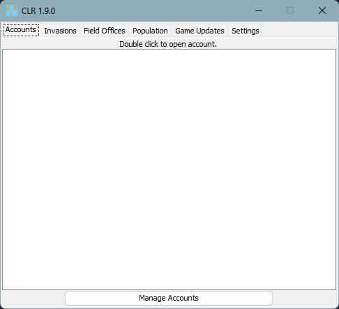
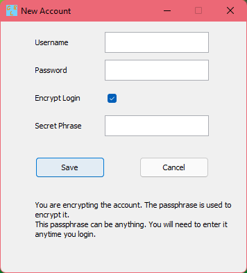
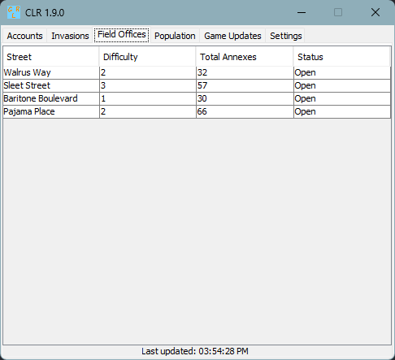
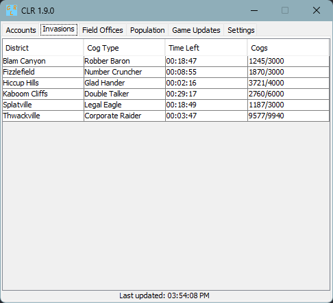
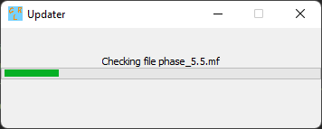
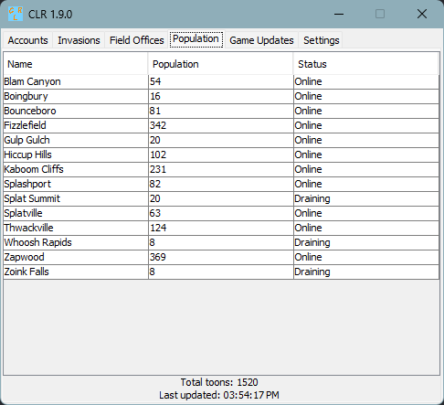
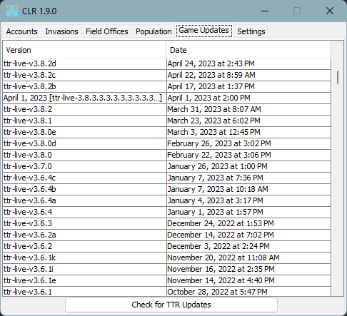

This might not be fully 100% correct, as the program can change!

## Main Window

This is the main display of the launcher. This shows the accounts and has tabs to other features at the top.

<figure markdown="span">
  
</figure>

## New Account
<figure markdown="span">
  
</figure>

## Field Office Tracker
<figure markdown="span">
  
</figure>

## Invasion Tracker
<figure markdown="span">
  
</figure>

## Game Updater
<figure markdown="span">
  
</figure>

## Population Tracker
<figure markdown="span">
  
</figure>

## Release Notes
<figure markdown="span">
  
</figure>